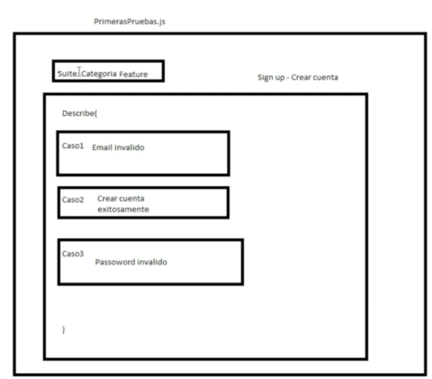

## TEST USE CYPRESS


- Install

```shell
npm install cypress --save-dev

```

- Execute runner

```shell
➜  $ node_modules/.bin/cypress open
It looks like this is your first time using Cypress: 9.3.1

✔  Verified Cypress! /Users/manu/Library/Caches/Cypress/9.3.1/Cypress.app

Opening Cypress...
```
or
```shell
npm run cy:open
```


## RUNNERS

Interface web for execute test

## SUITE CATEGORIES



### Feature

- Contiene los describe 
- Cada describe tiene casos a ejecutar


