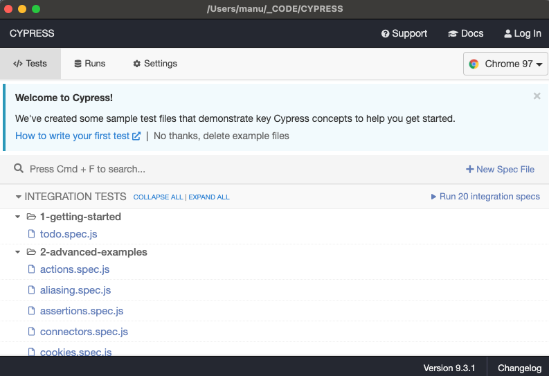

## TEST USE CYPRESS


- Install

```
npm installcypress --save-dev
```

- Execute runner

```
➜  $ node_modules/.bin/cypress open
It looks like this is your first time using Cypress: 9.3.1

✔  Verified Cypress! /Users/manu/Library/Caches/Cypress/9.3.1/Cypress.app

Opening Cypress...
```




## RUNNERS

Interface web for execute test


